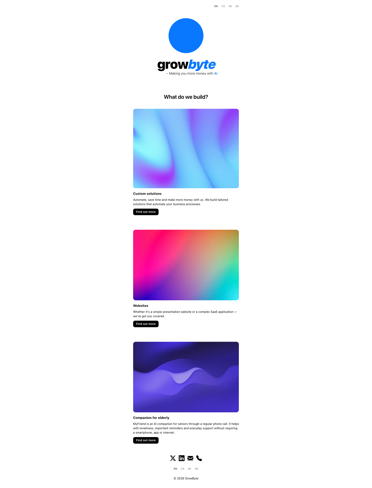

# GrowByte Website

This repo contains the source code of the [growbyte.co](https://growbyte.co) website.

GrowByte is a "holding company" under which I do most of my projects. This website serves as a showcase of all the things that I (the company) do.

There are 3 main sections:

### 1. Custom solutions

Here I talk about what I do for other companies. There are some solutions and case studies that I do / have done so people can see what I can do for them ;)

### 2. Websites

This redirects to my other website - a website agency ([webovka.online](https://webovka.online))

### 3. Companion for elderly

This is the main page for my MyFriend project. 28% of elderly people in the US live alone. That's why I built MyFriend. MyFriend is an AI companion for elderly. It's a phone number that they can call any time just to chat, or get help with some questions. It can also call them to remind them to eg. take their medications on time, so that they never forget.

 

